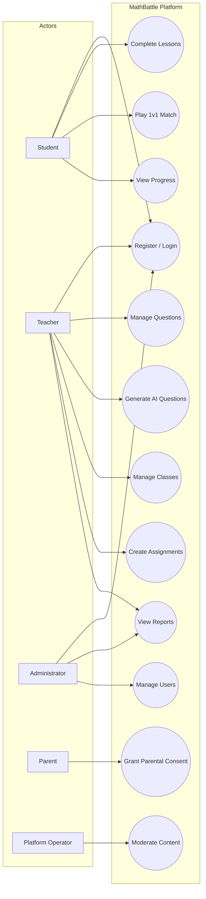

# Use Case Diagrams — MathBattle

**Version:** 1.0.0  
**Status:** Approved for Engineering

---

## Purpose

Use case catalog for Phase 1 MVP. Diagrams use Mermaid notation.

---

## Actors

| Actor | Description |
|---|---|
| Student | K–12 learner |
| Teacher | Classroom educator |
| Administrator | School admin |
| Parent | Consent provider (under-13 flow only) |
| Platform Operator | Internal staff |
| AI Provider | External system (secondary actor) |
| Email Service | External system (secondary actor) |

---

## System Use Case Diagram

---

## Use Case Catalog

### Authentication

| ID | Use Case | Actor | Priority |
|---|---|---|---|
| UC-AUTH-01 | Register account | Student, Teacher | P0 |
| UC-AUTH-02 | Login | All | P0 |
| UC-AUTH-03 | Reset password | All | P0 |
| UC-AUTH-04 | Grant parental consent | Parent | P0 |
| UC-AUTH-05 | Logout | All | P0 |

### Learning

| ID | Use Case | Actor | Priority |
|---|---|---|---|
| UC-LRN-01 | Browse learning path | Student | P0 |
| UC-LRN-02 | Start and complete lesson | Student | P0 |
| UC-LRN-03 | View lesson results | Student | P0 |
| UC-LRN-04 | Track progress | Student | P0 |

### Matches

| ID | Use Case | Actor | Priority |
|---|---|---|---|
| UC-MATCH-01 | Find opponent | Student | P0 |
| UC-MATCH-02 | Play match | Student | P0 |
| UC-MATCH-03 | View match history | Student | P0 |
| UC-MATCH-04 | Reconnect to active match | Student | P0 |

### Question Bank

| ID | Use Case | Actor | Priority |
|---|---|---|---|
| UC-QB-01 | Create/edit question | Teacher | P0 |
| UC-QB-02 | Import questions | Teacher | P0 |
| UC-QB-03 | Generate AI questions | Teacher | P0 |
| UC-QB-04 | Review and publish question | Teacher | P0 |
| UC-QB-05 | Search question bank | Teacher | P0 |

### Classroom

| ID | Use Case | Actor | Priority |
|---|---|---|---|
| UC-CLS-01 | Create and manage class | Teacher | P0 |
| UC-CLS-02 | Create assignment | Teacher | P0 |
| UC-CLS-03 | View class performance | Teacher | P0 |

### Administration

| ID | Use Case | Actor | Priority |
|---|---|---|---|
| UC-ADM-01 | Manage school users | Administrator | P0 |
| UC-ADM-02 | View school reports | Administrator | P0 |
| UC-ADM-03 | Configure school settings | Administrator | P0 |
| UC-ADM-04 | Review audit logs | Administrator | P1 |

---

## Include / Extend Relationships

| Base Use Case | Relationship | Related Use Case |
|---|---|---|
| Play match | «include» | Authenticate |
| Play match | «include» | Validate answer |
| Play match | «extend» | Detect focus loss |
| Generate AI questions | «include» | Queue AI job |
| Register (under 13) | «extend» | Send parental consent |

---

*See `User-Stories.md` for agile stories and `FRS-Detailed.md` for functional specifications.*
